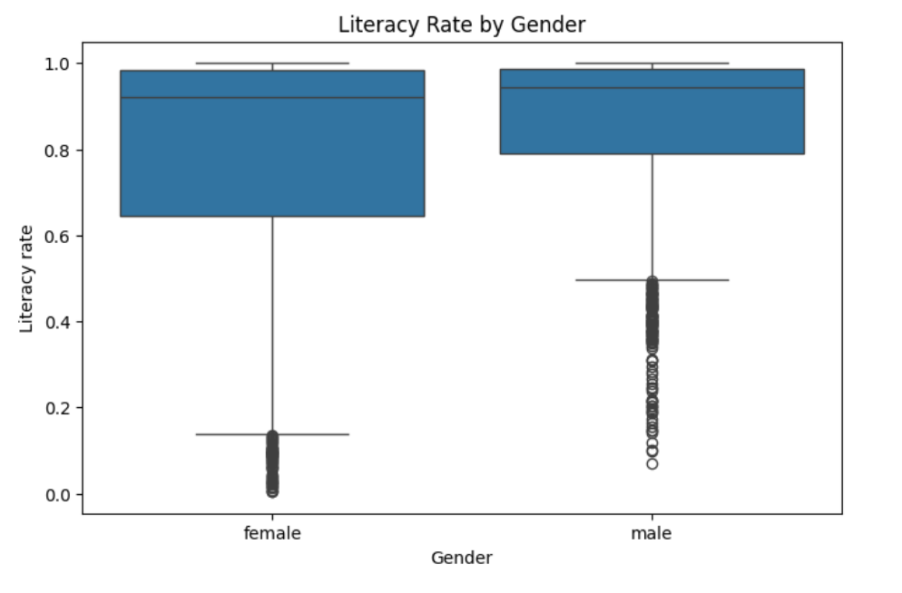

# 📚Literacy-Rates-Analysis
A comprehensive data analysis project exploring global literacy trends, demonstrating skills in data cleaning, EDA, and deriving actionable insights for social impact.

-----

# Global Literacy Trends Analysis

##  Project Overview

This project provides a comprehensive data analysis of global literacy rates, identifying key trends, disparities across regions and genders, and offering actionable insights for non-profit organizations focused on education. By meticulously cleaning and analyzing a rich dataset of literacy rates, this study pinpoints areas of critical need and proposes targeted intervention strategies to combat educational inequality worldwide.

##  Problem Solved: Bridging the Literacy Gap

While many countries boast high literacy rates, a closer look reveals persistent disparities that hinder global educational equity. This project addresses the critical need to:

  * **Identify regions with low literacy rates:** Pinpointing geographical areas where educational access and outcomes are significantly lower.
  * **Uncover gender disparities:** Highlighting the consistent gap where female literacy rates remain lower than male rates across various age groups and regions.
  * **Provide data-driven recommendations:** Offering actionable insights to non-profit organizations on where to focus their resources for maximum impact in improving literacy, particularly for vulnerable groups like young girls in underserved regions.

This analysis directly supports evidence-based decision-making for organizations striving to achieve Sustainable Development Goal 4: Quality Education.

##  📊Dataset

The core of this analysis is the `literacy_rates_updated.xlsx` dataset, which contains detailed information on literacy rates across various dimensions:

  * **Region:** Geographical categorization of countries.
  * **Country:** Specific nations included in the study.
  * **Year:** Annual literacy rate data.
  * **Age:** Age demographics (e.g., \<15, 15-24, 25-64, 65+).
  * **Gender:** Male and female literacy rates.
  * **Literacy rate:** The numerical literacy rate.

## 🛠Methodology

This project employed a robust data analysis pipeline to ensure data quality and derive meaningful insights:

1.  **Data Loading & Initial Inspection:**

      * Loaded the `literacy_rates_updated.xlsx` dataset using Pandas.
      * Performed initial checks on data types, null values, and unique entries across key categorical columns (`Region`, `Country`, `Year`, `Age`, `Gender`) to identify inconsistencies.

2.  **Comprehensive Data Cleaning:**

      * **Inconsistency Handling:** Standardized categorical values by stripping whitespace and unifying gender entries (e.g., 'm'/'f' to 'male'/'female').
      * **Duplicate Removal:** Identified and eliminated duplicate rows to maintain data integrity.
      * **Data Type Correction:** Converted `Year` to an integer and `Literacy rate` to a float, addressing any non-numeric entries and ensuring rates were correctly represented (e.g., dividing by 100 if values exceeded 1).
      * **Missing Value Imputation:**
          * Filled missing `Region` values by propagating known country-region associations.
          * Imputed missing `Literacy rate` values using the median rate specific to each region, falling back to the global median if a regional median was unavailable.
      * **Outlier Detection:** Verified that all 'Literacy rate' values fell within the expected range of 0 to 1 after cleaning.

3.  **Exploratory Data Analysis (EDA) & Visualization:**

      * Utilized `matplotlib` and `seaborn` to visualize literacy trends and patterns.
      * Analyzed literacy rates by region, highlighting high-performing and low-performing areas.
      * Examined gender-based literacy disparities over time, observing a consistent gap where female rates lagged behind male rates, despite overall improvements.

4. **Visuals:**
     * 
     * 
     * 
     * 
   

##  Key Findings & Impact

This analysis yielded critical insights that can drive strategic interventions:

  * **Regional Disparities:** While global literacy is generally high, significant variations exist, with Europe and Northern America leading, while Sub-Saharan Africa and Central and Southern Asia exhibit generally lower average literacy rates.
  * **Persistent Gender Gap:** A notable and consistent gap exists between male and female literacy rates across all observed periods and age groups, with female rates consistently lower.
  * **Youth Literacy Challenges:** Despite overall high youth literacy, specific regions like parts of Sub-Saharan Africa and Central/Southern Asia still face low youth literacy rates and pronounced gender gaps disadvantaging girls.
  * **Actionable Recommendations:** The findings strongly suggest that non-profit efforts should be concentrated on these low-literacy regions. Programs should be specifically designed to empower young girls and foster community engagement to ensure their continued education.

##  🛠Technologies Used

  * **Python:** Programming Language
  * **Pandas:** Data manipulation and analysis
  * **NumPy:** Numerical operations
  * **Matplotlib:** Data visualization
  * **Seaborn:** Enhanced data visualization

##  How to Run the Project
    
## How to Run the Project

## How to Run the Project

To run this analysis locally, clone the repository and install the required dependencies:

```bash
git clone https://github.com/Elsie-Muhumuza/literacy-rates-analysis.git
cd literacy-rates-analysis
pip install -r requirements.txt

-----
